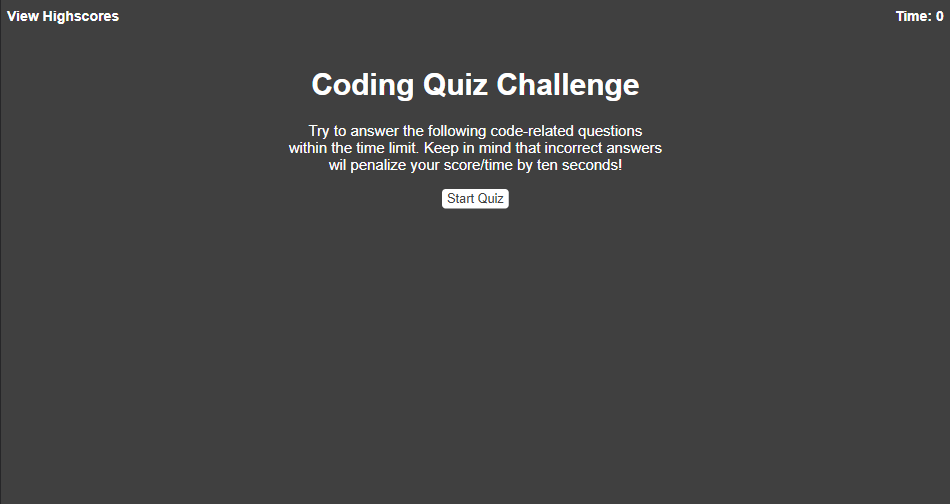
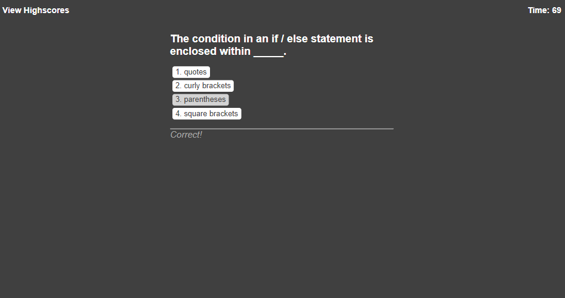

# 04 Web APIs: Code Game

## Description

This project is a multiple choice quiz with coding oriented questions. There are five questions with a time limit of 75 seconds, when a question is answered incorrectly 10 seconds are taken off of the timer, and once all questions have been answered the remaining time is the final score. After the quiz is finished the user can input their initials and display their score on a highscores list along with previous players, the highscore list can also be cleared with the "Clear Highscores" at the end of the quiz.

[Deployed Application](https://emill0004.github.io/04-Web-APIs-Code-Game/)

